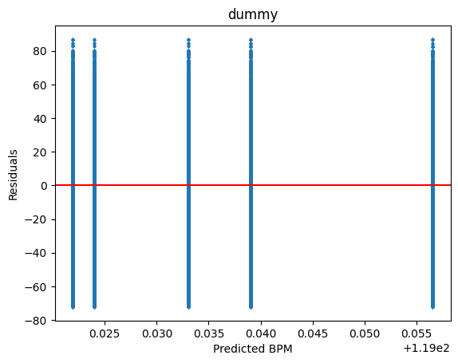
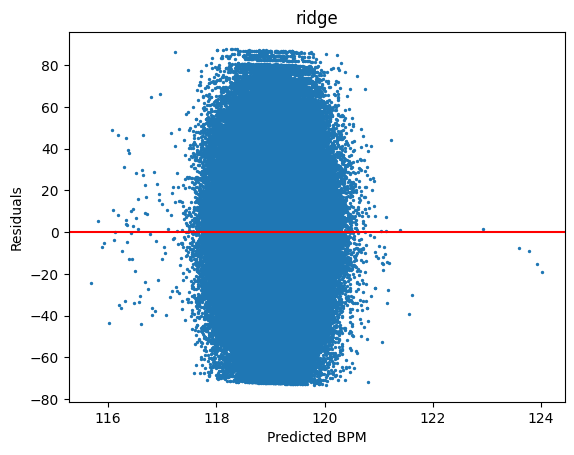
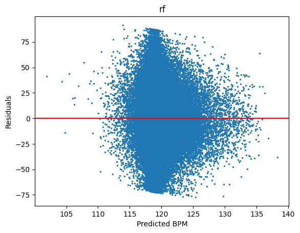
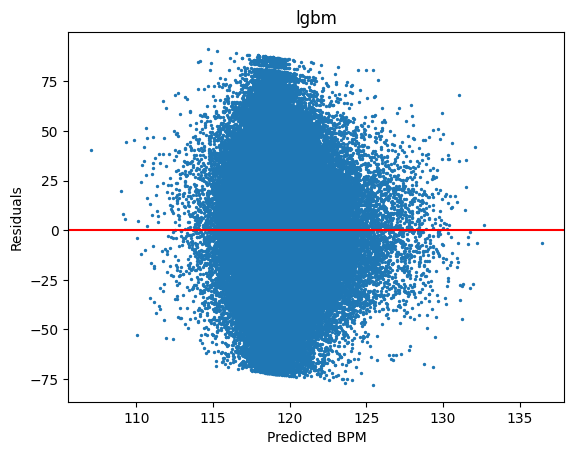

# Kaggle Competition: Predicting the Beats per Minute of Songs

## Objective
The goal of this competition is to predict a song's beats-per-minute.

## 📂 Structure
- `data/` → raw, processed and external data.
- `notebooks/` → notebook flow: EDA → baseline → modeling → submission.
- `src/` → reusable functions for preprocessing, modeling e metrics.
- `results/` → charts, metrics and Kaggle submission.
- `models/` → trained models binaries.
- `requirements.txt` → dependencies.

## How to Run
1. Clone the repository:
   ```bash
   git clone https://github.com/Menezes-Gus/Predicting-the-Beats-per-Minute-of-Songs-Kaggle.git
   ```
2. To Install Dependencies:
    ```bash
   pip install requirements.txt
   ```
3. If you don't already have the data zip file in data/raw folder, run download_data.py:
    ```bash
   python src/download_data.py
   ```
4. If you don't already extracted the zip file downloaded in the previous step, run extract_zip.py:
    ```bash
   python src/extract_zip.py
   ```


Name: Gustavo Menezes

LinkedIn:  www.linkedin.com/in/gustavomenezes-263b00156 

GitHub: https://github.com/Menezes-Gus

```bibtex
@misc{playground-series-s5e9,
    author = {Walter Reade and Elizabeth Park},
    title = {Predicting the Beats-per-Minute of Songs},
    year = {2025},
    howpublished = {\url{https://kaggle.com/competitions/playground-series-s5e9}},
    note = {Kaggle}
}
```


### 1- What is the problem that needs to be solved?
##### I have a dataset with simulated data, based on a real dataset about BPM Prediction. The challenge is to predict BeatsPerMinute using the other features.
### 2- What the features mean?
##### Ideally, the challenge would have a discription of each feature. Sadly, that's not the case with this dataset. Hence, a bit of interpretation and inference will be needed.
|Feature|Description|
|-------|-----------|
|id (integer)| primary key|
|RhythmScore (float)|probably measures how consistent is the rhythmic pattern. Higher values indicate more consistency|
|AudioLoudness (float)|in dB scale. The closer to 0 the higher the volume. Its in negative scale because its common to measure loudness relative to full scale|
|VocalContent (float)|proportion of vocals in the song|
|AcousticQuality (float)|indicates how acoustic (vs electronic) the song is|
|InstrumentalScore (float)|same as VocalContent, but in regards to instruments besides vocals|
|LivePerformanceLikelihood (float)|the likelihood of the audio to be a live performance|
|MoodScore (float)|probably related to how "happy" or "sad" the song sounds. Higher values probably mean "happier" songs|
|TrackDurationMs (float)|track duration in miliseconds|
|Energy (float)|indicates intensity|
|BeatsPerMinute (float)|target variable, regression problem, since it is a continuous one|
### 3-What are the data sorts (numerical, categorical, textual content, etc.)?
##### Everything is numerical, continuous. The data types were specified in the previous question.
### 4-Is there any previously known information on troubles or obstacles?
##### Not that i know of.
### 5-Are there any relevant area-unique issues or constraints?
##### Most of the data is already standardized.
##### AudioLoudness is in a dB scale relative to full scale, hence, its negative values.
##### TrackDurationMs and AudioLoudness need standardization. 
### 6-Relevant Findings and Information
#### EDA insights
##### Most features don't correlate to each other, with the exception of a somewhat significant negative correlation between Energy and AcousticQuality (pearson, spearman and kendal).
##### Some outliers were found, but, due to the fact that the data is already (mostly) standardized, it looks like they're probably not actual outliers, or at least, they are outliers that hold relevant information.
#### Feature Engineering and preprocessing 
##### I decided to create some flags to indicate when an entry appears to be an outlier, since it doesn't seem like a good idea to delete them.
##### For the baseline, a opted for a dummy regressor based on mean as a sanity check. Then, a Ridge Regression to test how a linear model would perform (and also to help with feature selection), a Random Forest Regressor, due to low correlation between features, and a LGBM Regressor, mostly out of curiosity.
##### Created a Vocal/Instrumental ratio, based on the assumption that instrumental songs may be more constant and have lower BPM, while songs with vocals may have more changes in the structure to accommodate the singing, hence, possibly higher BPM.
##### Created an Energy and Rhythm interaction, based on the assumption that both energy and rhythmscore may be present in songs with higher BPM, so, when combined in a multiplication, their combined value should be high enough to distance itself apart from slower songs
##### Created MoodScore bins, based on the hypotesis that, because it measures something akin to an emotion, probably works better as a range. Also, due to the usage of Ridge Regression, dummy variables where created aswell.
#### Baseline modelling and diagnostics
##### RANDOM_STATE=42
##### KFold with K=5 was also used during training, mostly to prevent overfitting and to use all of the available data
|Model|RMSE|MAE|
|-----|----|---|
|dummy|26.468078417587844|21.19987341149104|
|ridge|26.466341374596727|21.19792095039579|
|random forest|26.465788481708348|21.197653869516085|
|lgbm|26.467350811600735|21.198498087056862|
##### The models don’t really look very promissing. They mostly performed the same as the dummy based on the mean. This suggests that the features don’t show clear predictive power over the target.
##### Permutation importance also showed that the features hold little importance in predicting the target.
##### A lot of feature engineering will probably be needed.
##### Below is a table of segmented RMSE, calculated over 5 percentiles
|Percentiles|RMSE (dummy)|RMSE (ridge)|RMSE (random forest)|RMSE (lgbm)|
|--------|------------|------------|--------------------|-----------|
|P1(0%-20%)|38.537388|38.528707|38.501665|38.510559|
|P2(20%-40%)|15.007049|15.011208|15.031465|15.032779|
|P3(40%-60%)|3.951164|3.967620|4.073729|4.073727|
|P4(60%-80%)|14.614545|14.616610|14.638233|14.633230|
|P5(80%-100%)|39.538506|39.537165|39.535175|39.533093|
##### This analysis show that all of the models do a good job predicting "average" songs BPM, but, struggle as the songs gets faster or slower. Features more sensible to these extremes are desirable.
##### Below are the residuals ploted against the predicted BPM

##### The dummy model has this 5 vertical residual lines because of the kfold with k=5.

##### The Ridge model tried to predict essentially the average for almost all songs. And, as it is possible to see in the chart above, it didn't really captured significant information to discern between slower and faster songs. 

##### The Random forest model also tried to predict values close to the average for almost all songs. But, it is possible to notice a certain "bulge" to the right, indicating that the model managed to extract a bit more information over the features, when compared to the Ridge model.

##### The same can be said to lgbm.
##### These residual plots confirm that all models collapse towards the mean (a strong bias). The usage of feature engineering or domain-specific variables is required to improve performance, specially at the extremes.
##### The First Submission (with the baseline) got me 1481th place out of 2,035 participants and 1,986 teams. Considering this was a minimal solution, it sets a benchmark to improve upon in the next iterations.

##### More feature engineering was done, this time using autofeat. The algorithm sugested the creation of new variables:
1. VocalContent^3  / Energy
2. Energy^3 / AcousticQuality
3. MoodScore^3 * RhythmScore^2
4. sqrt(LivePerformanceLikelihood) * TrackDurationMs^2
##### The models were re-fited with those added interaction variables. The results didn't significantly changed.
|Model|RMSE (original)|RMSE (with interaction variables)|MAE (original)|MAE (with interaction variables)|
|-----|----|---|----|----|
|dummy|26.468078417587844|26.468078417587844|21.19987341149104|21.19987341149104|
|ridge|26.466341374596727|26.465385825000094|21.19792095039579|21.197030571261287|
|random forest|26.465788481708348|26.465305023507657|21.197653869516085|21.196963534692447|
|lgbm|26.467350811600735|26.467526741672962|21.198498087056862|21.198457247155215|
##### Automatic feature generation (polynomials, ratios, logs, etc.) was tested with multiple strategies, but results did not show meaningful improvements. Further progress will likely require domain-specific engineered variables or rely on optimization of hyperparameters.
##### I submitted the results of the best trained model (with engineered features), random forest. The submission's RMSE actually got worse.

##### I decided to use a classification model to try to predict the extremes and create a feature. This way, i expected the new flags to help the regression models. While in the permutation importance dataframe, some of them showed potential, the actual result was a little bit worse then the baseline submission.

##### Since there were no improvements with the added classificassion feature, the last options that i see are Stacking, Deep Learning (MLP) and/or Hyperparameter optmization. First i'll try stacking, and, if there is enough time, hyperparameter optimization, and then MLP.
##### I decided to create 3 Stacks, the baseline models (the ones that resulted in better performance in submission) where used as estimators, and the meta models were Rigde, LGBM and RandomForest. This was the results:
1. Ridge:

2. RandomForest:

3. LGBM:

##### Both Ridge and LGBM achieved improvements, and catapulted me to the 844th position :)

##### I also made a manual stacking, using Ridge as the meta model, and, i got 0.00001 less RMSE, which made me go 1 position up. This may have happened because Kaggle only evaluates 20% of the data in order to build its leaderboard.

##### Tried a blend, using the baseline models + the manual stacking, and got a little improvement


##### The competition is OVER

##### I did not got a very good position, but, i definetly learned a lot

